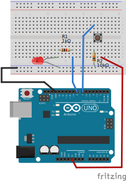
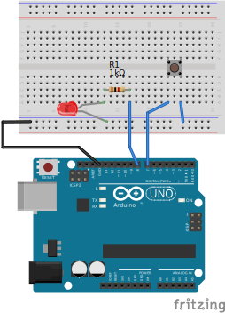
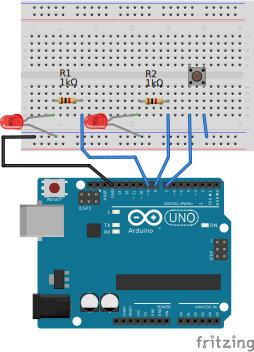
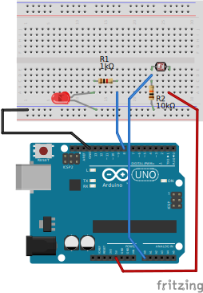
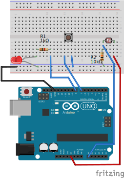

# 第3回 

## タクトスイッチを使う - 前回のおさらい

前回授業のおさらいとして、タクトスイッチ動作確認のためのブレッドボード上の回路を再現して動かしてみます。

- 補足

## Arduinoのデジタル入力を使う：タクトスイッチ

#### Arduinoのデジタル入力とは？

Arduinoでは、指定したピンに加わっている電圧を読み取り、```HIGH``` もしくは ```LOW``` （```HIGH``` = 1、```LOW``` = 0）として認識することができます。

### Arduinoを経由して、前回のLEDを光らせる回路を制御する



<details>
<summary>サンプルコード</summary>

```c++
/* 1008_1.ino */

// Arduinoの出力ピンにスケッチ内で使う別名を付ける
// 7番ピンを _SW1 という名前に、8番ピンを _LED1 という名前に
#define _SW1 7
#define _LED1 8

void setup() {
  // _SW1（7番ピン）を入力にする
  pinMode(_SW1, INPUT);

  // _LED1（8番ピン）を出力にする
  pinMode(_LED1, OUTPUT);
}

void loop() {
  // デジタル入力から読み取ったタクトスイッチの状態を使って、LEDの点灯状態を制御する
  digitalWrite(_LED1, digitalRead(_SW1));
}
```
</details>

### ON / OFF を反転させてみる

スケッチを書き換えることで、ブレッドボード上の配線を変更することなくタクトスイッチを押したときの挙動を反転させることができます。

<details>
<summary>サンプルコード</summary>

```c++
/* 1008_2.ino */

// Arduinoの出力ピンにスケッチ内で使う別名を付ける
// 7番ピンを _SW1 という名前に、8番ピンを _LED1 という名前に
#define _SW1 7
#define _LED1 8

void setup() {
  // _SW1（7番ピン）を入力にする
  pinMode(_SW1, INPUT);

  // _LED1（8番ピン）を出力にする
  pinMode(_LED1, OUTPUT);
}

void loop() {
  // デジタル入力から読み取ったタクトスイッチの状態を使って、LEDの点灯状態を制御する
  // 「!」という記号（論理否定演算子）を使って、押す・離すの挙動を反転させたバージョン
  digitalWrite(_LED1, !digitalRead(_SW1));
}
```
</details>

### Arduino内臓のプルアップ抵抗を使った方法に変更する

これまでのサンプルで使っていた回路は、デジタル入力ピンに対して、いわゆる「プルダウン」抵抗を外付け部品として入れた状態でした。

Arduinoには内臓の「プルアップ」抵抗があり、今回のような単純なスイッチなどをデジタル入力として読み取りたい場合などには、それを使うようにすることでブレッドボード上の配線や外付け部品を減らすことができます。



<details>
<summary>サンプルコード</summary>

```c++
/* 1008_3.ino */

// Arduinoの出力ピンにスケッチ内で使う別名を付ける
// 7番ピンを _SW1 という名前に、8番ピンを _LED1 という名前に
#define _SW1 7
#define _LED1 8

void setup() {
  // _SW1（7番ピン）を入力にする・「プルアップ」バージョン
  pinMode(_SW1, INPUT_PULLUP);

  // _LED1（8番ピン）を出力にする
  pinMode(_LED1, OUTPUT);
}

void loop() {
  // デジタル入力から読み取ったタクトスイッチの状態を使って、LEDの点灯状態を制御する
  // 「!」という記号（論理否定演算子）を使って、押す・離すの挙動を反転させたバージョン
  digitalWrite(_LED1, !digitalRead(_SW1));
}
```
</details>

### Arduino IDEでデジタル入力の値を表示させてみる

Arduino IDEにはシリアルモニタ（Serial Monitor）と呼ばれる、スケッチ内に決められた文法で書いた内容をテキストのメッセージとして出力できるエリアがあります。


このシリアルモニタを使って、タクトスイッチの状態を Arduino IDE 上で可視化してみます。

<details>
<summary>サンプルコード</summary>

```c++
/* 1008_4.ino */

// Arduinoの出力ピンにスケッチ内で使う別名を付ける
// 7番ピンを _SW1 という名前に、8番ピンを _LED1 という名前に
#define _SW1 7
#define _LED1 8

// デジタル入力読み取り用の変数（タクトスイッチの状態を記憶する領域）を設定する
int swState = 0;

void setup() {
  // _SW1（7番ピン）を入力にする・「プルアップ」バージョン
  pinMode(_SW1, INPUT_PULLUP);

  // _LED1（8番ピン）を出力にする
  pinMode(_LED1, OUTPUT);

  // シリアルモニタ用の通信の初期化処理
  Serial.begin(19200);
}

void loop() {
  // デジタル入力から読み取ったタクトスイッチの状態を変数に記憶する
  swState = !digitalRead(_SW1);

  // シリアルモニタに表示するメッセージ・ラベル用のテキスト・改行なし
  Serial.print("_SW1_State:");
   // シリアルモニタに表示するメッセージ・変数「swState」の数値を表示・改行あり
  Serial.println(swState);

  // 変数を使ってLEDの点灯状態を変える
  digitalWrite(_LED1, swState);

  // 200ミリ秒待つ
  // （待ち時間を入れないと、タクトスイッチを押す・離すの動作による変化が早すぎてわかりにくいので）
  delay(200);
}
```
</details>

### 応用：複数個のLEDとタクトスイッチでカウンタのようなものを作ってみる

これまでのサンプルのおさらい・応用として、複数個のLEDを異なる出力ピンに接続しておき、タクトスイッチを押した回数に応じてどのLEDを点灯させるかを制御するようなスケッチを考えてみます。



<details>
<summary>サンプルコード</summary>

```c++
/* 1008_5.ino */

// Arduinoの出力ピンにスケッチ内で使う別名を付ける
// 7番ピンを _SW1 という名前に、8番ピンを _LED1 という名前に、9番ピンを _LED2 という名前に
#define _SW1 7
#define _LED1 8
#define _LED2 9

// デジタル入力読み取り用の変数（タクトスイッチの状態を記憶する領域）を設定する
int swState = 0;

// カウンタ用の変数（カウントした数を記憶しておく）を設定する
int pushCount = 0;

void setup() {
   // _SW1（7番ピン）を入力にする・「プルアップ」バージョン
  pinMode(_SW1, INPUT_PULLUP);

  // _LED1（8番ピン）を出力にする
  pinMode(_LED1, OUTPUT);
  // _LED2（9番ピン）を出力にする
  pinMode(_LED2, OUTPUT);

  // シリアルモニタ用の通信の初期化処理
  Serial.begin(19200);
}

void loop() {
  // デジタル入力から読み取ったタクトスイッチの状態を変数に記憶する
  swState = !digitalRead(_SW1);

  // タクトスイッチが押されたら1カウントアップする
  // 「%」という記号（余剰演算子）を使って、0・1・2・3と数えたらまた0に戻るようにする
  pushCount = (pushCount + swState) % 4;

  // シリアルモニタに表示するメッセージ
  Serial.print("_SW1_State:");
  Serial.print(swState);
  Serial.print(",Count:");
  Serial.println(pushCount);

  // 「&」という記号をビット演算子として使って、特定のカウントの時だけ点灯させる
  // （若干わかりにくい書き方なので、別の方法も後述します）
  digitalWrite(_LED1, pushCount & 1); // カウントが1・3の時だけ点灯
  digitalWrite(_LED2, pushCount & 2); // カウントが2・3の時だけ点灯

  // 200ミリ秒待つ
  // （待ち時間を入れないと、タクトスイッチを押す・離すの動作によるカウントアップが早すぎてわかりにくいので）
  delay(200);
}
```
</details>


## Arduinoのアナログ入力を使う：CdSセル

#### Arduinoのアナログ入力とは？

Arduinoではデジタル入力のほかに、指定したピンに加わっている電圧を連続的な数値として読み取れるアナログ入力の機能を持ったピンが存在します。

Arduino UNO R3 / R4では ```A0``` から ```A5``` ピンがそれに該当し、0Vから5Vまでの電圧を0から1023までの数値として認識することができます。

#### CdSセル


周囲の明るさによって抵抗値が変化する（可変）抵抗として機能する素子です。

基本的に暗い環境下では抵抗値が高くなり、逆に明るい環境下では抵抗値が低くなります。

### Arduino IDEでアナログ入力の値を表示させてみる

[Arduino IDEでデジタル入力の値を表示させてみる](#arduino-ideでデジタル入力の値を表示させてみる) のスケッチを書き換えて、どのような値が入力されているかを確認します。



<details>
<summary>サンプルコード</summary>

```c++
/* 1008_6.ino */

// Arduinoの出力ピンにスケッチ内で使う別名を付ける
// A0番ピンを _CDS1 という名前に、8番ピンを _LED1 という名前に
#define _CDS1 A0
#define _LED1 8

// アナログ入力読み取り用の変数（CdSセルの状態を記憶する領域）を設定する
int cdsVal = 0;

void setup() {
  // _CDS1（A0ピン）を入力にする
  pinMode(_CDS1, INPUT);

  // _LED1（8番ピン）を出力にする
  pinMode(_LED1, OUTPUT);

  // シリアルモニタ用の通信の初期化処理
  Serial.begin(19200);
}

void loop() {
  // アナログ入力から読み取ったCdSセルの状態を変数に記憶する
  cdsVal = analogRead(_CDS1);

  // シリアルモニタに表示するメッセージ
  Serial.print("_CDS1_Value:");
  Serial.println(cdsVal);

  // 100ミリ秒待つ
  // （待ち時間を入れないと、変化が早すぎてわかりにくいので）
  delay(100);
}
```
</details>

### 入力値を使った条件分岐 - デジタル出力と組み合わせて使う

アナログ入力から読み取った数値が、ある値を超えたときだけ何かを動作させたい、といったことはよくあるケースです。

Arduinoで使われているプログラミング言語は、C++ という言語がもとになっていますが、条件分岐を実現するための制御構文として、他のプログラミング言語でもよくある「if文（ ```if (...) { ... } else { ... }``` ）」が使用できます。

if文を使って、アナログ入力の数値が一定以上の時にLEDを点灯させ、逆の時に消すというスケッチを考えてみます。

<details>
<summary>サンプルコード</summary>

```c++
/* 1008_7.ino */

// Arduinoの出力ピンにスケッチ内で使う別名を付ける
// A0番ピンを _CDS1 という名前に、8番ピンを _LED1 という名前に
#define _CDS1 A0
#define _LED1 8

// アナログ入力読み取り用の変数（CdSセルの状態を記憶する領域）を設定する
int cdsVal = 0;

void setup() {
  // _CDS1（A0ピン）を入力にする
  pinMode(_CDS1, INPUT);

  // _LED1（8番ピン）を出力にする
  pinMode(_LED1, OUTPUT);

  // シリアルモニタ用の通信の初期化処理
  Serial.begin(19200);
}

void loop() {
  // アナログ入力から読み取ったCdSセルの状態を変数に記憶する
  // (CdSセルにあたっている光の強さに対応する 0 ~ 1023 までの数値)
  cdsVal = analogRead(_CDS1);

  // シリアルモニタに表示するメッセージ
  Serial.print("_CDS1_Value:");
  Serial.println(cdsVal);

  if(cdsVal < 100) {
    // アナログ入力の値が100より低い場合にLEDを点灯
    //（CdSセルに対してあまり光が当たっていない状態）
    digitalWrite(_LED1, HIGH);
  } else {
    // アナログ入力の値が100より高い場合にLEDを消灯
    //（CdSセルに対してある程度光が当たっている状態）
    digitalWrite(_LED1, LOW);
  }

  // 100ミリ秒待つ
  // （待ち時間を入れないと、変化が早すぎてわかりにくいので）
  delay(100);
}
```
</details>

### 応用：より複雑な条件分岐 - 複数の入力・出力を組み合わせて使う

後半のサンプルのおさらい・応用として、複数のif文を使ってタクトスイッチが押されている時だけCdSセルの状態を読み取るようにし、その値に応じてLEDの点滅状態を制御する、というスケッチを考えてみます。



<details>
<summary>サンプルコード</summary>

```c++
/* 1008_8.ino (excerpt) */

// Arduinoの出力ピンにスケッチ内で使う別名を付ける
// A0番ピンを _CDS1 という名前に、7番ピンを _SW1 という名前に、8番ピンを _LED1 という名前に
#define _CDS1 A0
#define _SW1 7
#define _LED1 8

// アナログ入力読み取り用の変数（CdSセルの状態を記憶する領域）を設定する
int cdsVal = 100;
// デジタル入力読み取り用の変数（タクトスイッチの状態を記憶する領域）を設定する
int swState = 0;
// デジタル出力8番ピン用の変数（8番ピンの状態を記憶する領域）を設定する
int ledState = 0;
// タイマー用の変数（プログラムが起動してからの時間を記憶する領域）を設定する
unsigned long lastTime = 0;

void setup() {
  // _CDS1（A0ピン）を入力にする
  pinMode(_CDS1, INPUT);
   // _SW1（7番ピン）を入力にする・「プルアップ」バージョン
  pinMode(_SW1, INPUT_PULLUP);

  // _LED1（8番ピン）を出力にする
  pinMode(_LED1, OUTPUT);
}

void loop() {
  // デジタル入力から読み取ったタクトスイッチの状態を一時的な変数に記憶する
  int tmp_s = !digitalRead(_SW1);

  // デジタル入力に変化があった時だけ更新するテクニック
  if (swState != tmp_s) {
    swState = tmp_s;
  }

  // タクトスイッチが押されている時だけアナログ入力から値を読み取って更新
  if (swState > 0) {
    // アナログ入力から読み取った値を変数に記憶する
    cdsVal = analogRead(_CDS1);
  }

  // プログラムが起動してからの時間を一時的な変数に記憶する
  // millis() は、プログラムが起動してからの時間をミリ秒で取得する組み込み関数
  unsigned long tmp_t = millis();

  // 最後に取得した経過時間 lastTime と上記 tmp_t に記憶した経過時間の差分を計算する
  // アナログ入力から読み取った値より上記の差分が大きければ、デジタル出力 _LED1 の状態を反転させる
  // constrain() は値を一定の範囲内に制限する組み込み関数
  // この場合、10ミリ秒～1000ミリ秒の範囲で、一定周期でLEDを点滅させる動作になる
  if ((tmp_t - lastTime) > constrain(1000 - cdsVal, 10, 1000)) {
    ledState = !ledState;
    digitalWrite(_LED1, ledState);
    // 最後に取得した経過時間を新しい値で更新しておく
    lastTime = tmp_t;
  }

  // 10ミリ秒待つ
  delay(10);
}
```
</details>

#### _シリアルプロッタの使い方_

[Arduino IDEでデジタル入力の値を表示させてみる](#arduino-ideでデジタル入力の値を表示させてみる) の例のようなデジタル入力（ONかOFFか）で、入力の数が少ない場合は、シリアルモニタのテキスト表示でもある程度は状態を確認できます。

一方で、時間に応じた連続的な変化を見たい場合や、複数の入力の変化を同時並行して確認したい場合などには、Arduino IDE に付属しているシリアルプロッタのグラフ表示の方が有用な場合があります。


<details>
<summary>サンプルコード</summary>

```c++
/* 1008_8.ino (excerpt) */

//...

void setup() {
  // ...
  Serial.begin(19200);
}

void loop() {
  // ...

  Serial.print("_CDS1_Value:");
  Serial.print(cdsVal);
  Serial.print(",_SW1_State:");
  Serial.print(swState);
  Serial.print(",Led_State:");
  Serial.println(ledState);

  // 10ミリ秒待つ
  delay(10);
}
```
</details>


## 次回以降に使う開発ボードについて - Arduino と互換開発ボード

### Arduino IDE と開発ボードとしての Arduino について

#### そもそも「Arduino」とは？

> Arduino (/ɑːrˈdwiːnoʊ/) is an Italian open-source hardware and software company, project, and user community that designs and manufactures single-board microcontrollers and microcontroller kits for building digital devices.

> Arduino（アルドゥイーノ もしくは アルデュイーノまたはアルディーノ）とは、（ハードウェアの）「Arduinoボード」、および（ソフトウェアの）「Arduino IDE」から構成されるシステムである。

[Wikipedia(英)](https://en.wikipedia.org/wiki/Arduino) / [Wikipedia(日)](https://ja.wikipedia.org/wiki/Arduino)

**Arduino** は上記リンクの説明の通り

- オープンソースのハードウェア（= この講義内では「開発ボード」のひとつとして呼ぶ意味での Arduino）
- オープンソースの開発環境（= Arduino IDE、および関連ライブラリなど）

からなるシステムです。

本講義内で、単に「Arduino」というときは、開発ボードとしての Arduino Uno R3 / R4 を指すものとしますが、開発ボードとしての Arduino も実際には下記のリンクにあるように、複数のバリエーション・バージョンが存在します。

https://docs.arduino.cc/hardware/

また、前述にあるように、Arduinoプロジェクトはソフトウェア、ハードウェア共に基本的にオープンソースとなっているため、ソースコードや回路図、基板設計図などが公開されており、Arduino ボードに関しては、ほぼ同じ仕様で、開発元・製造元が異なる「互換品」も非常に多数存在しています。

### Raspberry Pi Pico について

#### Raspberry Pi プロジェクト

[Wikipedia(英)](https://en.wikipedia.org/wiki/Raspberry_Pi) / [Wikipedia(日)](https://ja.wikipedia.org/wiki/Raspberry_Pi)

**Raspberry Pi** （および Raspberry Pi プロジェクト）は英国のラズベリー・パイ財団が開発する製品群です。

https://www.raspberrypi.com/documentation/computers/raspberry-pi.html

当初は教育用途の安価なコンピューターとして普及させることを目指していたため、一般的なデスクトップPCやラップトップPCと比べて価格が安く、小型であることが特徴です。

また、ディスプレイモニタやキーボードなどの周辺機器を除いたコンピューターとしての基本的な機能がひとつの基板上にまとまっているため、「シングルボードコンピューター（SBC）」の一種としても認知されています。

#### Raspberry Pi Pico (W / WH)

**Raspberry Pi Pico** はRaspberry Piのプロジェクトに比較的最近追加された製品であり、それまでのようなLinux OSが動く汎用的なSCBではなく、Arduinoボードのようにマイクロコントローラーが搭載された開発ボードです。

2024年現在、Raspberry Pi Pico にもいくつかのバリエーション・バージョンが存在し、末尾に「W」もしくは「WH」がつくものが、無線通信用のモジュールを搭載しているものです。

https://www.raspberrypi.com/documentation/microcontrollers/pico-series.html#picow-technical-specification


### Arduino と Raspberry Pi Pico W のどちらかを選択するにあたって

下記はいずれも完全な説明ではありませんが、本講義内で扱う限りで知っておいた方が良い違いを挙げたものです。

#### 動作電圧、電源・消費電力

- Arduino UNO (R3 / R4)
  - 5Vの動作電圧
    - デジタル出力で ```HIGH``` を出力した際、基本的に**5Vが出力されます**。
    - アナログ入力では **0V~5V を 0~1023** の数値に変換します 
    - アナログ入力・デジタル入力には基本的に5**Vまでの電圧を入力できます** 。
  - 電源・消費電力
    - USBコネクタからの供給：5V
    - DCジャックからの供給：**6~20V (推奨7~12V、R3) or 6~24V (R4)**
    - 電源ピン（**VIN**）からの供給：**6~20V (推奨7~12V、R3) or 6~24V (R4)**
    - 使い方にもよりますが、基本的に**消費電力が大きいです**。
      - R3は特に。逆にメリットとして、R3は各ピンに流せる電流の最大値が20mAと大きくとれます。
- RPi Pico W
  - 3.3Vの動作電圧
    - デジタル出力で ```HIGH``` を出力した際、基本的に**3.3Vが出力されます**。
    - アナログ入力では **0V~3.3V を 0~1023** の数値に変換します。
    - アナログ入力・デジタル入力には基本的に**3.3Vまでの電圧を入力できます** 。
  - 電源・消費電力
    - USBコネクタからの供給：5V
    - 電源ピンからの供給：**1.8~5.5V**
    - 使い方にもよりますが、基本的に**消費電力が小さいです**。
      - 無線通信を長時間行ったりする場合は、その増加分が大きいため、一概には言えません。 

#### 価格と入手性

互換品を除くと、基本的に RPi Pico W の方が安価です。入手性は現状（2024年10月現在）そこまで変わりません。

#### 開発のしやすさ、扱いやすさ

- Arduino UNO (R3 / R4)
  - Arduino IDE 標準として扱えるボードです。
- RPi Pico W
  - Arduino IDE にボードの設定を追加することで、Arduino ボードとほぼ同じように使えます。
  - **ライブラリなどに定義されているデフォルト値が特殊な場合があります**。
  - ブレッドボードと合わせて使う場合は基本的にブレッドボード上に刺して使う必要がある（自身でピンソケットをはんだ付けした場合は別）ので、その分スペースを使います。
 
#### 開発ボードが標準で備えている機能など

- Arduino UNO (R3 / R4)
  - 無線通信の機能を使うためには、より高価な Arduino UNO R4 WiFi を選択するか、外付けのモジュールを使用する必要があります。
  - **ハードウェアによるPWM出力のチャンネル数は6で、固定のピンに割り当てられています**。
    - ただし、R4は近い用途として使えるアナログ「出力」ピン（```A0 / DAC```）を1つ追加で持っています。
- RPi Pico W
  - **標準で無線通信モジュールを備え、無線通信の機能を使うことができます**。
  - **アナログ入力として使用できるピンの数が少ない（3つ）です**。
  - **ハードウェアによるPWM出力のチャンネル数が多く、大半のピンに割り当てることができます**。
