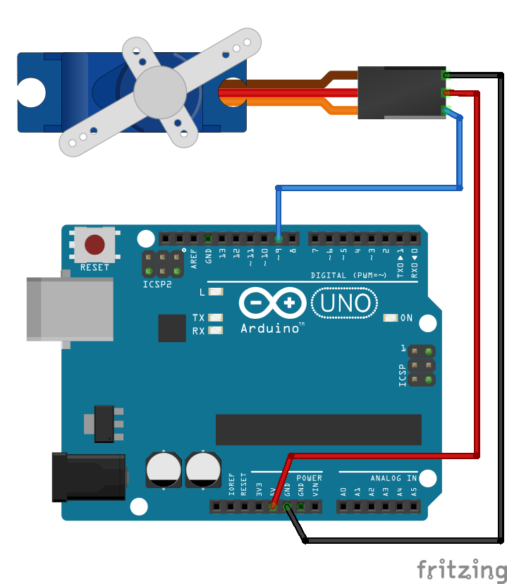

# 第7回：物理的な動きや仕掛けをつくる - モーター・サーボモーター

サンプルコード

## サーボモーターを使う

### Arduino でサーボモーターを使う

```Servo``` ライブラリを使って、接続した SG90 を動かしてみます。

[今回使うサーボモーターの仕様](https://akizukidenshi.com/goodsaffix/SG90_a.pdf)



<details>
<summary>サンプルスケッチ</summary>

```c++
/* 1105_servo_simple.ino */

#include <Servo.h>

#if (defined(PICO_RP2040))
#define _SRV_OUTPIN 0
#else
#define _SRV_OUTPIN 9
#endif

Servo srv1;

int angle = 0;

void setup() {
  pinMode(_SRV_OUTPIN, OUTPUT);

  // サーボモーター（SG90）の初期化。
  // 指定可能なパルス幅の範囲が異なる場合は初期化時に指定する。
  srv1.attach(_SRV_OUTPIN, 500, 2400);
  srv1.write(angle);

  Serial.begin(57600);
}

void loop() {
  srv1.write(angle);

  Serial.print("Angle: ");
  Serial.println(angle);

  // 2秒間隔で30°ずつ動かす。180°まで行ったら0°に戻す.
  angle += 30;
  if (angle > 180) angle = 0;

  delay(2000);
}
```
</details>

---

### シリアル通信で指定した角度に動かす

シリアル通信を使って、接続した SG90 を任意の角度に動かしてみます。

<details>
<summary>サンプルスケッチ</summary>

```c++
/* 1105_servo_with_serial */

#include <Servo.h>

#if (defined(PICO_RP2040))
#define _SRV_OUTPIN 0
#else
#define _SRV_OUTPIN 9
#endif

Servo srv1;

int angle = 90;

unsigned long tick = 0;

const byte numChars = 64;
char receivedChars[numChars];

bool newData = false;

void setup() {
  pinMode(_SRV_OUTPIN, OUTPUT);

  // サーボモーター（SG90）の初期化。
  // 指定可能なパルス幅の範囲が異なる場合は初期化時に指定する。
  srv1.attach(_SRV_OUTPIN, 500, 2400);
  srv1.write(angle);

  Serial.begin(57600);
}

void loop() {
  recvWithEndMarker();

  if (newData == true) {
    String tmp_str = String(receivedChars);
    String tmp_perms[2] = { "", "" };
    int sidx = 0, pidx = 0;

    while (true) {
      int fidx = tmp_str.indexOf(' ', sidx);
      if (fidx != -1) {
        String sstr = tmp_str.substring(sidx, fidx);
        sidx = fidx + 1;
        if (pidx < 2) {
          tmp_perms[pidx] = sstr;
          pidx ++;
        } else {
          break;
        }
      } else {
        String rstr = tmp_str.substring(sidx, tmp_str.length());
        if (pidx < 2) {
          tmp_perms[pidx] = rstr;
        }
        break;
      }
    }

    Serial.println(tmp_str);

    if (tmp_perms[0].length() != 0) {
      angle = map(tmp_perms[0].toInt(), 0, 1023, 0, 180);

      Serial.print("Raw[0]:");
      Serial.print(tmp_perms[0]);
      Serial.print(",Angle:");
      Serial.println(angle);

      srv1.write(angle);
    }

    newData = false;
  }

  if ((millis() - tick) > 1000) {
    tick = millis();
    Serial.println("tick");
  }
}

void recvWithEndMarker() {
  static byte ndx = 0;
  const char endMarker = ';';
  char rc;

  if (Serial.available()) {
    while (Serial.available() > 0 && newData == false) {
      rc = Serial.read();

      if (rc != endMarker) {
        receivedChars[ndx] = rc;
        ndx++;
        if (ndx >= numChars) {
          ndx = numChars - 1;
        }
      }
      else {
        receivedChars[ndx] = '\0'; // terminate the string
        ndx = 0;
        newData = true;
      }
    }
  }
}
```
</details>

---

### サーボモーターの治具を考える

大抵の市販されているサーボモーターには __ホーン__ と呼ばれる駆動部分に取り付けるパーツがいくつか付属しています。

実際に作品に組み込んで使う場合、単純な角度の動き以外にしたい場合など、これらの付属のホーンをうまく応用するか、必要に応じて治具を自作する必要があります。


---


## モーターを使う

### Arduino でモーターを使う

---
