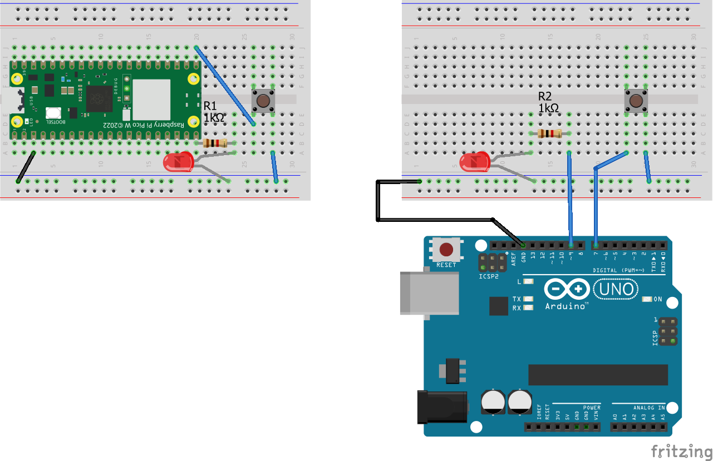
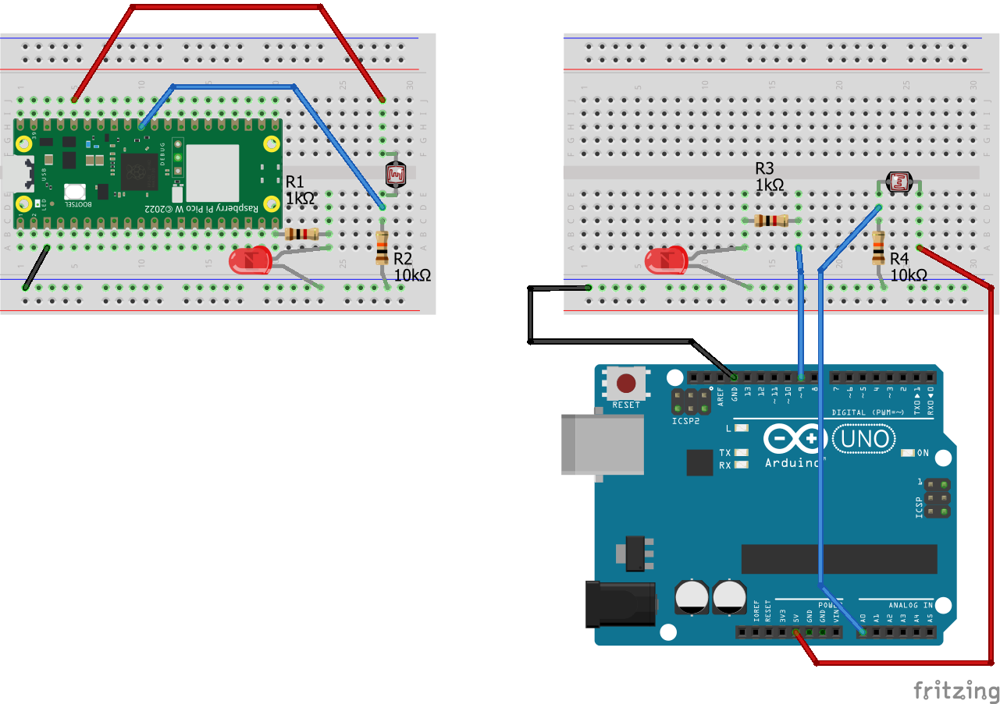
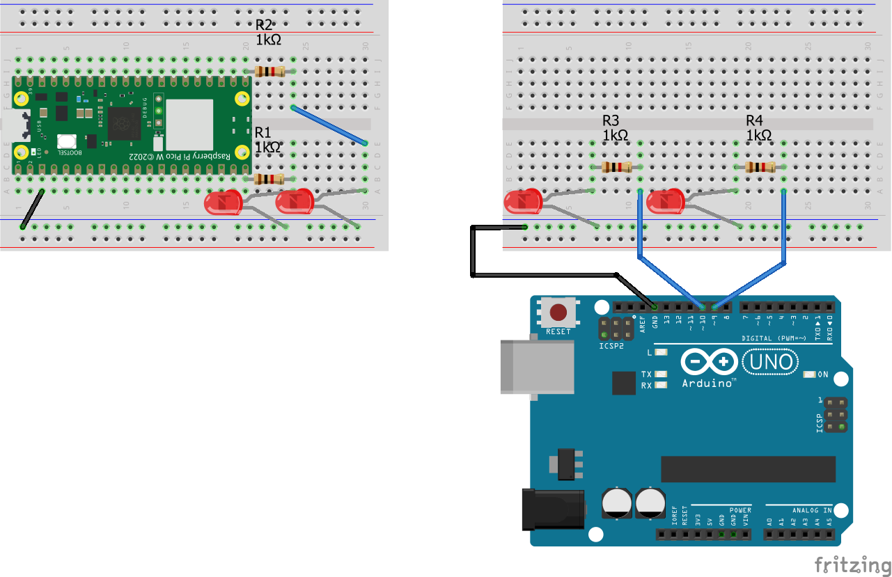

# 第4回：アナログ出力、シリアル通信

## 前回のおさらい

- 前回サンプルひと通りの振り返り
  - プルアップ・プルダウンの説明訂正
- 残りのサンプル・セクション
  - アナログ入力応用サンプル
  - Arduino IDEのシリアルプロッタの使い方
  - Arduino / RPi Pico W 各ボードについての説明補足

## Raspberry Pi Pico W の導入

### Arduino IDEのセットアップ、ファームウェアのアップデート

[Raspberry Pi Pico W を Arduino IDE で使う]()

## アナログ出力（PWM）を使う

#### Arduino におけるアナログ出力とは？

これまでの講義内で、LEDやパワーリレーなどの外部のデバイスを制御する際には ```digitalWrite()``` を使ったON / OFFのみを行っていました。

Arduino 開発環境では、このようなON / OFFのみの制御以外に、連続的な数値（0 ~ 254。ただし対応している開発ボードは解像度を高いものに変更できる場合がある）を使って、指定したピンからこの数値に対応した任意の電圧を出力することができる ```analogWrite()``` という機能が存在します。

#### PWM

```analogWrite()``` は、多くの場合、厳密に言うと名前の通りの「アナログ波形の出力」ではなく、**PWM (= Pulse Width Modulation、パルス幅変調)** という技術を使った、一種の「疑似的な」アナログ出力です。

#### ピンアサインについて

- Arduino UNO R3 / R4
  - ボード上の番号に ```~``` の記号がついているピン
    - ```3~```、```5~```、```6~```、```9~```、```10~```、```11~```
  - R4のみ上記に加えて、```A0``` もアナログ出力（PWMではない、DA変換を用いたもの）として使えます
- Raspberry Pi Pico W

### LEDの明るさを段階的に変えてみる

```analogWrite()``` を使って、LEDの明るさを段階的に変えてみます。



<details>
<summary>サンプルスケッチ</summary>

```c++
/* 1015_1_pwm.ino */

// Raspberry Pi Pico W: GPIO16番ピンを _SW1 という名前に、GPIO15番ピンを _LED1 という名前に
// Arduino UNO: 7番ピンを _SW1 という名前に、9番ピンを _LED1 という名前に
#if (defined(PICO_RP2040))
#define _SW1 16
#define _LED1 15
#else
#define _SW1 7
#define _LED1 9
#endif

// デジタル入力読み取り用の変数を設定
int swState = 0;

// PWMのデューティー比（= LEDの明るさ）を記憶する変数を設定
int brightness = 0;

// 経過時間計測用の変数を設定
unsigned long lastPushed;

void setup() {
  pinMode(_SW1, INPUT_PULLUP);
  pinMode(_LED1, OUTPUT);

  lastPushed = millis();

  Serial.begin(19200);
}

void loop() {
  int tmp_s = !digitalRead(_SW1);

  // デジタル入力に変化があった時だけ更新
  if (swState != tmp_s) {
    swState = tmp_s;
  }

  // タクトスイッチが押されてる経過時間が200ミリ秒以上の時だけ実行する
  if (swState && (millis() - lastPushed) >= 200) {

    // デューティー比の値をインクリメント（5ずつ足して、255で余剰演算）
    // 0 ~ 254 の間で変化する
    brightness = (brightness + 5) % 255;

    Serial.print("_SW1_State:");
    Serial.print(swState);
    Serial.print(",brightness:");
    Serial.println(brightness);

    // タクトスイッチ押下の経過時間をアップデート
    lastPushed = millis();
  }

  // PWM
  analogWrite(_LED1, brightness);
}
```
</details>

---

### LEDの明るさを連続的に変えてみる

```analogWrite()``` を使って、LEDの明るさを連続的に変えてみます。

<details>
<summary>サンプルスケッチ</summary>

```c++
/* 1015_2_pwm_fade.ino */

// Raspberry Pi Pico W: GPIO16番ピンを _SW1 という名前に、GPIO15番ピンを _LED1 という名前に
// Arduino UNO: 7番ピンを _SW1 という名前に、9番ピンを _LED1 という名前に
#if (defined(PICO_RP2040))
#define _SW1 16
#define _LED1 15
#else
#define _SW1 7
#define _LED1 9
#endif

// デジタル入力読み取り用の変数を設定
int swState = 0;

// 角度をを記憶する変数を設定
float deg = 0;

// 角速度を記憶する変数を設定
int speed = 1;

// 経過時間計測用の変数を設定
unsigned long elapsed;

// 経過時間計測（タクトスイッチ押下）用の変数を設定
unsigned long lastPushed;

void setup() {
  pinMode(_SW1, INPUT_PULLUP);
  pinMode(_LED1, OUTPUT);

  lastPushed = millis();
  elapsed = micros();

  Serial.begin(19200);
}

void loop() {
  int tmp_s = !digitalRead(_SW1);

  // デジタル入力に変化があった時だけ更新
  if (swState != tmp_s) {
    swState = tmp_s;
  }

  // タクトスイッチが押されてる経過時間が200ミリ秒以上の時だけ実行する
  if (swState && (millis() - lastPushed) >= 200) {

    // ビットシフトを利用した角速度の増加
    // 1, 3, 7, ...512, 1023 の間で変化する
    speed = (speed << 1) | speed;
    if (speed > 1024) { speed = 1; }

    Serial.print("_SW1_State:");
    Serial.print(swState);
    Serial.print(",speed:");
    Serial.println(speed);

    // タクトスイッチ押下の経過時間をアップデート
    lastPushed = millis();
  }

  // 500マイクロ秒に一回実行
  if ((micros() - elapsed) >= 500) {
    // cos() 関数を使った周期的なフェードイン・フェードアウト
    deg += (speed / 1023.0);
    int arc = abs((255 * cos(deg * M_PI / 180.0)));

    // PWM
    analogWrite(_LED1, arc);

    elapsed = micros();
  }
}
```
</details>

---

### アナログ入力の値を反映させてみる

```analogRead()``` で得られる値を ```analogWrite()``` に反映させるスケッチを考えてみます。 



<details>
<summary>サンプルスケッチ</summary>

```c++
/* 1015_3_pwm_aio.ino */

// Raspberry Pi Pico W: GPIO16番ピンを _SW1 という名前に、GPIO15番ピンを _LED1 という名前に
// Arduino UNO: 7番ピンを _SW1 という名前に、9番ピンを _LED1 という名前に
#if (defined(PICO_RP2040))
#define _CDS1 A0
#define _LED1 15
#else
#define _CDS1 A0
#define _LED1 9
#endif

// アナログ入力読み取り用のk各種変数（CdSセルの状態を記憶する領域）を設定する
// ノイズ対策のために、10サンプルの平均値を取る方法を採用
const int bufSize = 10;
int ainBuf[] = { 0, 0, 0, 0, 0, 0, 0, 0, 0, 0 };
int bIndex = 0;
int ainTotal = 0;

// 経過時間計測用の変数を設定
unsigned long elapsed;

void setup() {
  pinMode(_CDS1, INPUT);
  pinMode(_LED1, OUTPUT);

  elapsed = millis();

  Serial.begin(19200);
}

void loop() {
  // 直近10サンプルの平均値を取る
  ainTotal = ainTotal - ainBuf[bIndex];

  ainBuf[bIndex] = analogRead(_CDS1);

  ainTotal = ainTotal + ainBuf[bIndex];

  bIndex = (bIndex + 1) % bufSize;

  int avg = ainTotal / bufSize;

  // PWM
  // map() 関数を使って、マッピングする
  // 周囲の環境が明るいほど明るく点灯
  analogWrite(_LED1, map(avg, 5, 900, 0, 254));

  // 反転版。周囲の環境が暗いほど明るく点灯
  // analogWrite(_LED1, map(avg, 5, 900, 254, 0));

  // 50ミリ秒に一回実行
  if ((millis() - elapsed) >= 50) {
    Serial.println(avg);
    elapsed = millis();
  }

  delay(1);
}
```
</details>

---

### LED以外のデバイスを接続する

- デモのみ

---

## PCと連携させて使う：シリアル通信

#### Arduino におけるシリアル通信とは？

これまでの講義内で、Arduino IDE でデジタル入力（タクトスイッチの例）およびアナログ入力（CdSセルの例）の数値を確認する手段として、シリアルモニタやシリアルプロッタを紹介してきました。

これらのIDE上の機能は、Arduino 開発環境における ```Serial``` クラスを通じて、開発ボード側からPCに対してテータを送信することで実現されています。

 ```Serial``` クラスには、送信だけでなく受信のための機能も実装されており、両方を使うことでPCを含む（開発ボード側から見た）外部機器との双方向通信を行うことができるようになります。

#### シリアル通信概説

- 言葉としての定義
- UART
- 電気的規格 / 通信方式
- USBにおけるシリアルデバイスクラス

### Arduino IDE から開発ボード側にデータを送ってみる

Arduino IDE のシリアルモニタを使って簡単なコマンドを開発ボード側に送信し、LEDを制御してみます。

<details>
<summary>サンプルスケッチ</summary>

```c++
/* 1015_4_serial_ide.ino */

// Raspberry Pi Pico W: GPIO16番ピンを _SW1 という名前に、GPIO15番ピンを _LED1 という名前に
// Arduino UNO: 7番ピンを _SW1 という名前に、9番ピンを _LED1 という名前に
#if (defined(PICO_RP2040))
#define _LED1 15
#else
#define _LED1 9
#endif

int swState = 0;
int brightness = 0;

void setup() {
  pinMode(_LED1, OUTPUT);

  Serial.begin(115200);
}

void loop() {
  // シリアルポートへデータが送られてきているかをチェック
  if (Serial.available()) {
    // シリアルバッファにあるデータを String（文字列）として取り出す
    String s = Serial.readString();

    // 文字列を int（数値）として変換
    brightness = constrain(s.toInt(), 0, 254);

    Serial.println(brightness);
  }

  analogWrite(_LED1, brightness);
}
```
</details>

### シリアル通信を使ったより複雑なコミュニケーションと応用 - Arduino IDE 以外のソフトウェアを使って通信してみる

```Serial``` クラスの機能を使ったPCとの通信は、対応しているものであれば Arduino IDE 以外でも可能です。

```Serial``` クラスの機能を使ったPCとの通信を利用して、PCをこれまで使ってきたCdSセルやLEDなどの入出力デバイスの一種として扱うようなスケッチ / プログラムを考えてみます。

#### PC側のソフトウェアのインストール・セットアップ

- **Processing**
  - https://processing.org/download

- **plugdata**
  - https://plugdata.org/download.html



<details>
<summary>サンプルスケッチ</summary>

```c++
```
</details>